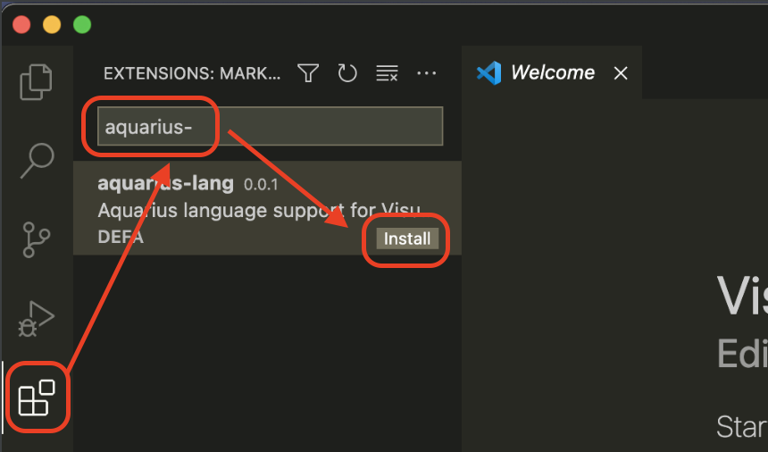

Aquarius
=


```aquarius
(show: "aquarius" "is" "a" "funny" "script")
```

Table of Contents
-

+ [What is Aquarius](#What-is-Aquarius) 
+ [Installation](#Installation)
+ [VSCode plugin](#VSCode-Plugin)
+ [Reserved](#Reserved)
+ [Components](#Components) 
  + [Require](#Require)
  + [Definition](#Definition)
  + [Assignment](#Assignment)
  + [Calling](#Calling)
  + [Controls](#Controls)
    + [If](#If)
    + [For](#For)
    + [Try](#Try)
+ [Builtin](#Builtin)
  + [Lambda](#Lambda)
  + [Basic](#Basic)
  + [Lib](#Lib)
+ [Proposal](#Proposal)
+ [Contributing](#Contributing)
+ [License](#License)

What is Aquarius
-
`Aquarius` is a dynamic script language, abbreviated as `AQR`. 
It is designed as simple as possible. Just like `Class` in 
object-oriented languages, `Lambda` is used to organize 
business logic in world of AQR. As Taoism says Dao generate one, 
one generate two, two generate three, three generate all things, 
`Lambda` plays the important role.

There are two types of `Lambda`, one is the role of the 
organizer of the module, and the other is the ordinary method.
`Module lambdas` are usually those `*.aqr` files, and ordinary 
lambdas are `lambda expressions`.

Installation
-

### Latest v0.1.8

+ [v0.1.8 for mac](https://github.com/afeduohz/aquarius/releases/download/v0.1.8/aquarius-v0.1.8-mac.zip)
+ [v0.1.8 for linux](https://github.com/afeduohz/aquarius/releases/download/v0.1.8/aquarius-v0.1.8-linux.zip)
+ [v0.1.8 for windows](https://github.com/afeduohz/aquarius/releases/download/v0.1.8/aquarius-v0.1.8-windows.zip)

VSCode Plugin
-

In the `Extensions` tab, please fill `aquarius-` in `Search Extension in Marketplace`
field, search and install it.



Sincerely welcome you to participate in the development of plugin and 
improve functions, to make Aquarius more pleasant to use.

[VSCode Plugin Repo](https://github.com/afeduohz/aquarius-vscode-extension)

Reserved
-

|type|words|
|----|-----|
|keywords| if eif else for try catch finally break continue let require as true false nil error self args lambda |
|names|puts show noop assert os time Nil String True False Error RegExp Range List Dict Int Float Math File Time|

Components
-
AQR is almost always composed of expressions, except `require` 
instruction.

### Comment

The design of the comment is very simple, all the content between
`#` will be discarded during compilation. `#` itself is not escaped.

__syntax 1:__
```aquarius
# here is single line comment #
```

__syntax 2:__
```aquarius
# 
this 
is 
multi-line
comments 
#
```

### Require

`require` is used to express the dependency on other modules. It 
is not an expression, but an instruction.

__syntax 1:__
```aquarius
( require {{module}} )
```

__syntax 2:__
```aquarius
( require {{module}} as {{name}} )
```

__example:__
```aquarius
(require examples/fibonacci)
(require examples/fibonacci as fib)
```

After `require` is called, the `{{module}}` can be used later.

```aquarius
# module usage after require #
(examples/fibonacci: 10)
```
More about how to call a lambda, please refer to [Calling](#Calling) later.

### Definition

The definition starts with `let` keyword, and the `=` sign connects the 
defined `{{name}}` and its `{{value}}`. it returns `{{value}}`.

__syntax:__
```aquarius
( let {{name}} = {{value}} )
```

Definitions are all lambda-level (scoped in which they are defined, 
and all sub context). 

One point to note is that you can refer the `{{name}}` in the scope
 before definition, but the value at this time is `nil`, and only after
 the definition, `{{value}}` can be obtained.

```aquarius
(puts: foo) # foo == nil #
(let foo = 1) # without this expression, there will be a runtime error #
```

### Assignment

The assignment looks like definition. The behavior of assignment is to 
first look for the `{{name}}` in current context, and if it cannot find it,
it will look for it in the outer context, until it is found. If not found 
it, a new `{{name}}` will be created in current context.

__syntax:__
```aquarius
( {{name}} = {{value}} )
```

You should define the `{{name}}` firstly, then can refer it. The below example 
will raise error.

__example:__
```aquarius
(puts: foo) # runtime error: 'foo' is not found #
(foo = 1)
```

### Calling

Calling is simple as below syntax snippet shown. The note is that parameters
are not limited, even if the parameters defined in [`Lambda`](#Lambda).

__syntax:__
```aquarius
( {{name}} {{method}} {{value}}... )
```

__example:__
```aquarius
(puts: 1 2 3) 
#
'puts' is a predefined lambda, which used to print out something into stdout
':' is method of puts, which means executing
'1' '2' '3' are parameters 
#
```

### Controls

There are just three types of control expressions, `if expression`, `for expression` 
and `try expression`. 

#### If

__syntax 1:__
```aquarius
( if {{expression}} : {{expression}}... )
```

__syntax 2:__
```aquarius
( if {{expression}} : 
  {{expression}}...
else
  {{expression}}...
)
```

__syntax 3:__
```aquarius
( if {{expression}} : 
  {{expression}}...
eif {{expression}} : 
  {{expression}}...
else
  {{expression}}...
)
```

#### For
In the `For` expression, we can use 2 special instructions `continue` 
and `break` to do special stop. Their behavior is similar to that in 
other languages.

+ break - exit from current loop immediately.
+ continue - move from current cycle into next cycle.

__syntax 1:__
```aquarius
( for {{expression}} :
  {{expression}}...
)
```

__syntax 2:__
```aquarius
( for {{expression}} :
  {{expression}}...
else
  {{expression}}...
)
```

#### Try

__syntax 1:__
```aquarius
( try
  {{expression}}... 
catch
  {{expression}}... 
)
```

__syntax 2:__
```aquarius
( try
  {{expression}}... 
catch
  {{expression}}... 
finally
  {{expression}}...
)
```

Builtin
-

In order to provide basic functionalities to you, we created 
some core modules and lambdas, and also provided additional libraries.

### Lambda

As mentioned earlier, `Lambda` is the most basic `one` in AQR. It
is divided into `two` categories:
+ Module - modules are those `*.aqr` files loaded from the file system
  (or those predefined) which are mainly use for logical abstraction.
+ lambda - lambda expressions.

__syntax:__
```aquarius
( |{{paraments}}...|
  {{expression}}... 
)
```

__examples:__
```aquarius
(||) # an empty lambda #

(|| 1 2) # foo lambda just return `2` #

(|i j| 1 2) # foo lambda with 2 parameters valued `nil` #

(|(i = 2) j| 1 2) # foo lambda's parameter i has default value `2` #
```

#### arguments

By default, the default value of each parameter is `nil`, you can 
also define the default value yourself. When the parameter does not 
specify a value at the time of the call, the default value will take 
effect.

#### names

+ self - the current closure (context).
+ args - the list of copy of arguments current context.
+ lambda - the `lambda` that generated current context.

### Basic

We provide basic modules/lambdas:

  + [Nil](./docs/nil.md)
  + [True](./docs/true.md)
  + [False](./docs/false.md)
  + [Int](./docs/int.md) 
  + [Float](./docs/float.md) 
  + [String](./docs/string.md) 
  + [List](./docs/list.md)
  + [Dict](./docs/dict.md) 
  + [RegExp](./docs/regexp.md) 
  + [Range](./docs/range.md) 
  + [Error](./docs/error.md)
  + [puts](./docs/puts.md)
  + [show](./docs/show.md)
  + [noop](./docs/noop.md)
  + [assert](./docs/assert.md)

### Lib

In addition to those core modules, we also provide a lot of libraries for 
you to use (and these are constantly being enriched).

  + [math](./docs/lib-math.md)
  + [os](./docs/lib-os.md)
    + [Process](./docs/lib-os-process.md)
    + [ProcessState](./docs/lib-os-processstate.md)
  + [fs](./docs/lib-fs.md)
    + [File](./docs/lib-fs-file.md)
    + [FileMode](./docs/lib-fs-filemode.md)
    + [FileInfo](./docs/lib-fs-fileinfo.md)
  + [exec](./docs/lib-exec.md)
    + [Cmd](./docs/lib-exec-cmd.md)
  + [http](./docs/lib-http.md)
    + [Query](./docs/lib-http-query.md)
    + [Request](./docs/lib-http-request.md)
    + [Response](./docs/lib-http-response.md)
    + [Cookie](./docs/lib-http-cookie.md)
    + [Client](./docs/lib-http-client.md)
  + [time](./docs/lib-time.md)
    + [Time](./docs/lib-time-time.md)
    + [Duration](./docs/lib-time-duration.md)
    + [Timer](./docs/lib-time-timer.md)
    + [Ticker](./docs/lib-time-ticker.md)
  + encoding
    + [base32](./docs/lib-encoding-base32.md)
    + [base64](./docs/lib-encoding-base64.md)
    + [json](./docs/lib-encoding-json.md)
  + crypto
    + [md5](./docs/lib-crypto-md5.md)
    + [sha1](./docs/lib-crypto-sha1.md)
    + [sha256](./docs/lib-crypto-sha256.md)

#### X lib

Extensional functionalities written in pure aquarius.

Contributing
-
Hope you feel free to dive in.

Proposal
-
+ name definitions are not in the same convention, both camel case and underscore case.
+ Byte type
+ I/O abstraction
+ coroutine
+ log
+ file system ops enhancements

License
-
THIS REPOSITORY CREATES FOR SHARE AQUARIUS SCRIPTS. THE [LICENSE](./LICENSE) APPLY TO THESE PLAIN TEXT SCRIPTS WRITTEN IN AQUARIUS (EXCLUDE AQUARIUS LANGUAGE ITSELF).

